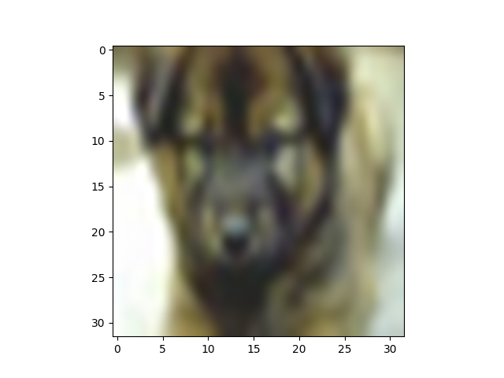

=======
LAT adversarial_robustness
=======

A fine tuning technique over the adversarially trained models to increase further robustness

Running the code
------------
**Dataset**: CIFAR10

**Fetching Adversarial Trained Model**

.. code-block:: bash

	python fetch_model.py

**Training via LAT**

.. code-block:: bash

	python feature_adv_training_layer11.py

**Latent Attack** 

.. code-block:: bash

	python latent_adversarial_attack.py

