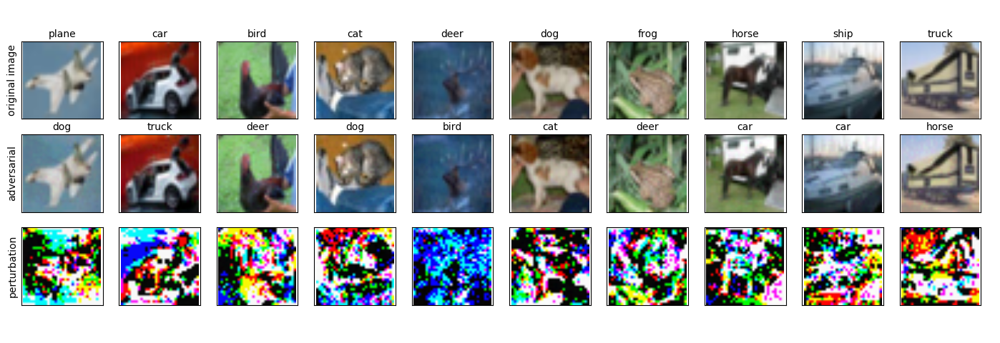
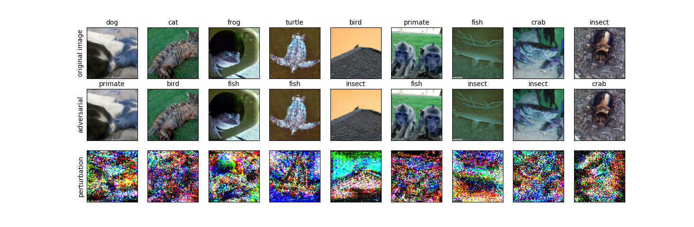

=======
LAT adversarial_robustness
=======

A fine tuning technique over the adversarially trained models to increase further robustness

Running the code
------------
**Dataset**: CIFAR10

**Fetching LAT robust model**

The model can be downloaded from this link - `https://drive.google.com/open?id=1um2zoVYYw5YZuuV8_IeoUy-qRWSmCVUb>` .

**Evaluating the LAT robust model**
.. code-block:: bash

	python eval.py

The trained model achieves test accuracy of 87.8% and adversarial robustness of 53.82% against PGD attack(epsilon = 8.0/255.0)

**Fetching Adversarial Trained Model**

.. code-block:: bash

	python fetch_model.py

**Training via LAT**

.. code-block:: bash

	python feature_adv_training_layer11.py

**Latent Attack** 

.. code-block:: bash

	python latent_adversarial_attack.py

Example original and adversarial images computed via Latent Attack on CIFAR10

Example original and adversarial images computed via Latent Attack on Restricted Imagenet(`https://arxiv.org/pdf/1805.12152.pdf 
<https://arxiv.org/pdf/1805.12152.pdf>`_.

